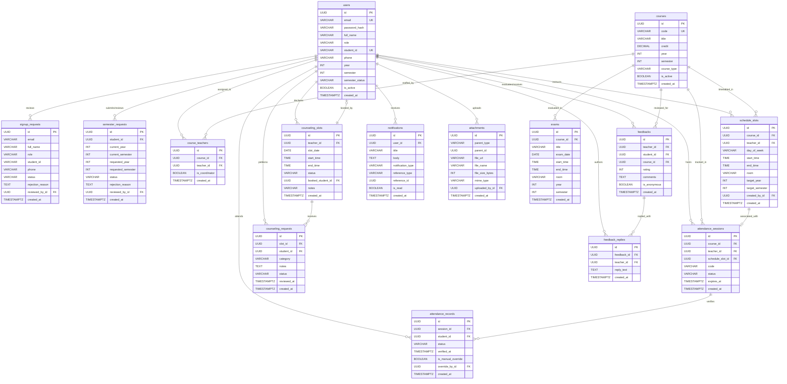

# Entity Relationships & Relational Model

This document outlines the entity relationships, relational cardinalities, foreign key cascade actions, and the complete Entity-Relationship (ER) diagram for **CSE JnU EduPortal**.

---

## 1. Cardinality & Relationship Matrix

| Primary Entity | Foreign Entity | Cardinality | Join Table / Key | Relationship Description |
| :--- | :--- | :---: | :--- | :--- |
| `users` (Teacher) | `courses` | **M:N** | `course_teachers` (`course_id`, `teacher_id`) | Teachers are assigned to multiple courses; courses have multiple instructors. |
| `users` (Student) | `courses` | **Implicit M:N** | Scoped by `(year, semester)` | Students automatically enroll in all courses matching their active `(year, semester)`. |
| `users` (Reviewer) | `signup_requests` | **1:N** | `signup_requests.reviewed_by_id` | Admin reviews multiple pending onboarding registrations. |
| `users` (Student) | `semester_requests` | **1:N** | `semester_requests.student_id` | Student submits semester progression petitions over time. |
| `courses` | `schedule_slots` | **1:N** | `schedule_slots.course_id` | A course has multiple weekly timetable slots. |
| `users` (Teacher) | `schedule_slots` | **1:N** | `schedule_slots.teacher_id` | A teacher conducts scheduled class slots. |
| `courses` | `exams` | **1:N** | `exams.course_id` | A course has midterm, lab, and final exam sessions. |
| `courses` | `attendance_sessions` | **1:N** | `attendance_sessions.course_id` | A course has many live attendance sessions over a term. |
| `users` (Teacher) | `attendance_sessions` | **1:N** | `attendance_sessions.teacher_id` | A teacher initiates attendance sessions. |
| `attendance_sessions`| `attendance_records` | **1:N** | `attendance_records.session_id` | An attendance session records many student verifications. |
| `users` (Student) | `attendance_records` | **1:N** | `attendance_records.student_id` | A student accumulates individual attendance records. |
| `users` (Teacher) | `counseling_slots` | **1:N** | `counseling_slots.teacher_id` | A professor creates multiple office hour availability slots. |
| `counseling_slots` | `counseling_requests`| **1:N** | `counseling_requests.slot_id` | Multiple students submit booking requests for an open slot. |
| `users` (Student) | `counseling_requests`| **1:N** | `counseling_requests.student_id` | A student submits appointment requests for counseling. |
| `users` (Teacher) | `feedbacks` | **1:N** | `feedbacks.teacher_id` | A professor receives course feedback evaluations. |
| `users` (Student) | `feedbacks` | **1:N** | `feedbacks.student_id` | A student authors feedback entries. |
| `feedbacks` | `feedback_replies` | **1:1 / 1:N** | `feedback_replies.feedback_id` | A feedback entry receives official teacher replies. |
| `users` | `notifications` | **1:N** | `notifications.user_id` | A user receives system and push notification alerts. |
| `users` | `attachments` | **1:N** | `attachments.uploaded_by_id` | A user uploads files for feedback, replies, or counseling. |

---

## 2. Foreign Key Cascade & Referential Actions

| Foreign Key Reference | On Delete Action | On Update Action | Rationale |
| :--- | :---: | :---: | :--- |
| `course_teachers.course_id` -> `courses.id` | `CASCADE` | `CASCADE` | Deleting a course removes instructor assignment links. |
| `course_teachers.teacher_id` -> `users.id` | `CASCADE` | `CASCADE` | Deleting a teacher user removes their assignment links. |
| `schedule_slots.course_id` -> `courses.id` | `RESTRICT` | `CASCADE` | Prevents accidental deletion of courses with active schedule slots. |
| `schedule_slots.teacher_id` -> `users.id` | `RESTRICT` | `CASCADE` | Prevents deletion of teacher users with active routine assignments. |
| `attendance_sessions.course_id` -> `courses.id` | `RESTRICT` | `CASCADE` | Preserves historical academic attendance records. |
| `attendance_records.session_id` -> `attendance_sessions.id` | `CASCADE` | `CASCADE` | Removing a session purges its verification roster records. |
| `attendance_records.student_id` -> `users.id` | `RESTRICT` | `CASCADE` | Protects student attendance history against accidental user purging. |
| `counseling_slots.teacher_id` -> `users.id` | `CASCADE` | `CASCADE` | Deleting a faculty account removes their upcoming office hours. |
| `counseling_requests.slot_id` -> `counseling_slots.id` | `CASCADE` | `CASCADE` | Cancelling a slot removes associated pending appointment requests. |
| `feedbacks.teacher_id` -> `users.id` | `RESTRICT` | `CASCADE` | Preserves departmental quality records for institutional evaluation. |
| `feedbacks.student_id` -> `users.id` | `SET NULL` | `CASCADE` | If a student account is closed, reviews are preserved anonymously. |
| `feedback_replies.feedback_id` -> `feedbacks.id` | `CASCADE` | `CASCADE` | Removing a feedback entry cleans up its reply thread. |
| `notifications.user_id` -> `users.id` | `CASCADE` | `CASCADE` | Deleting a user cleans up all their in-app notifications. |

---

## 3. Mermaid Entity-Relationship Diagram

